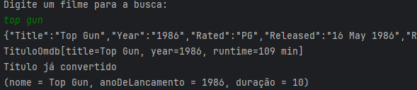
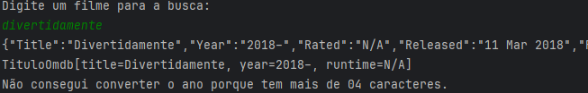
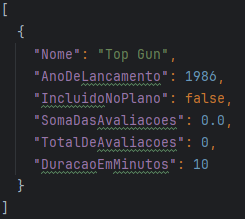

# 📽️ Projeto Screenmatch 📽️ 

---
#### 🚩 G7 ONE | Java e Orientação a Objetos | Java:  🚩
#### 🌎 [@Alura](https://www.alura.com.br/) | [@One](https://www.oracle.com/br/) 

*🎞️️ Projeto Screenmatch desenvolvido nas aulas do curso 🎞️️*

---
### Objetivos:
- Aprender a consumir uma API HTTP em Java;
- Entender como receber e converter dados no formato JSON;
- Utilizar a biblioteca externa GSON para fazer serialização e desserialização de dados;
- Lidar com erros e tratar exceções;
- Conhecer o pacote java.io para manipulação de arquivos.

---
### Observações:
 
 - _API utilizada(https://omdbapi.com/);_
 - _Biblioteca utilizada: Gson (https://mvnrepository.com/artifact/com.google.code.gson/gson/2.10.1) versão 2.10.1;_

---
### Inserir filme:
_Ao iniciar a aplicação você deverá escolher um filme que deseja buscar, desta forma ao confirmar sua escolha irá aparecer todos os dados do filme como demonstra a imagem abaixo:_

> 

### Erro na busca:
_Caso o filme escolhido não coincida com as informações da aplicação, irá retornar apenas algumas informações que foram possiveis buscar, porém não será salvo em nosso arquivo `.json`._

> 

### Arquivo `.Json`:
_Após a `1º` busca, será criado automaticamente um arquivo `filmes.json` onde será salvo todos os filmes que tiveram uma busca bem sucedida nesta aplicação, como demonstra as imagens abaixo:_ 

> 

> 